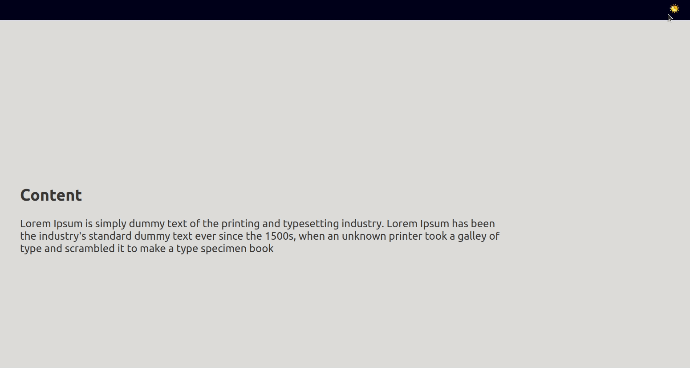

# Convert from useState to useReducer

## Task:

    You need to convert the previous React app from using useState to useReducer

## Screen shots:

## Requirements

- delete useState
- Use useReducer instead
- The app should still be able to change theme by clicking on Navbar icon

## Consider this

- make your reducer function responsible of changing theme logic
- make initial state object and put it along with the reducer as arguments for useReducer
- your toggleTheme function should be only responsible of dispatching the action
- you don't need to change any component except App
